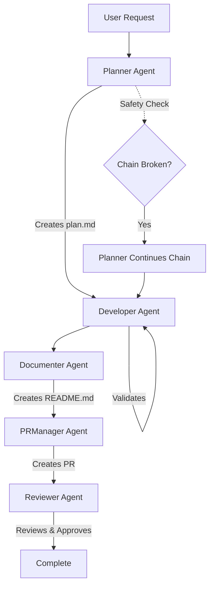

# Azure Deployment Agent Definitions

This folder contains the agent definitions that power the automated Azure development/testing/deployment workflows. Each agent is a specialized AI with specific responsibilities, tools, and instructions.

## What are Agents?

Agents are specialized AI assistants defined using VS Code's [custom agent specification](https://code.visualstudio.com/docs/copilot/customization/custom-agents). Each agent has:
- **Specific role and responsibilities**
- **Access to specialized tools** (Azure CLI, Bicep, GitHub CLI, MCP servers)
- **Step-by-step instructions** for their workflow
- **Ability to invoke other agents** to continue the workflow chain

## The Agent Workflow

The agents work in a **chain-of-responsibility pattern**, where each agent completes its work and invokes the next agent:

```
User Request → Planner → Developer → Documenter → PRManager → Reviewer
```

### Safety Mechanism
The **Planner** agent monitors the entire chain. If any agent fails to invoke the next one, the Planner autonomously continues the chain to ensure workflow completion.

## Available Agents

### 1. Planner (`planner.agent.md`)

**Role**: Solution architect and workflow orchestrator

**Responsibilities**:
- Analyze user requirements and ask clarifying questions
- Check Azure policies for conflicts (via Resource Graph)
- Research best practices from Microsoft Learn
- Design architecture with security, cost, and resilience in mind
- Create comprehensive plan.md with architectural decisions
- Invoke Developer agent
- Monitor workflow chain completion (safety mechanism)

**Tools**: 
- `azure-resource-graph/*` - Query Azure policies using Resource Graph MCP Server
- `microsoftdocs/mcp/*` - Research Azure best practices
- `agent` - Invoke other agents

**Key Instructions**:
- Never proceed without clear requirements
- Always check for conflicting policies
- Research architecture patterns before planning
- Monitor that full chain executes (Developer → Documenter → PRManager → Reviewer)

---

### 2. Developer (`developer.agent.md`)

**Role**: Infrastructure and application developer

**Responsibilities**:
- Read the plan.md created by Planner
- Generate Bicep templates with `targetScope='subscription'`
- Create resource group as part of deployment
- Generate application code (if needed)
- Execute Azure deployment using `az deployment sub create`
- Validate live deployment
- Test deployed endpoints
- Invoke Documenter agent

**Tools**:
- `bicep-(experimental)/*` - Bicep validation
- `azure-mcp/*` - Azure deployments
- `microsoftdocs/mcp/*` - API versions and best practices
- `execute` - Run Azure CLI commands

**Key Instructions**:
- All Bicep must use `targetScope='subscription'`
- Must create resource group in main.bicep
- Do NOT create shell scripts (.sh files) - use execute tool directly
- Deploy and validate before proceeding
- Never tell user to run commands manually

---

### 3. Documenter (`documenter.agent.md`)

**Role**: Technical writer and documentation specialist

**Responsibilities**:
- Analyze deployed infrastructure and code
- Create/update README.md in workload folder
- Document architecture, setup, and usage
- Include actual deployment details (IPs, endpoints)
- Verify Azure terminology accuracy with MS Learn
- Invoke PRManager agent

**Tools**:
- `microsoftdocs/mcp/*` - Verify terminology
- `read`, `edit`, `search` - Documentation tools

**Key Instructions**:
- Include live deployment details
- Provide actionable commands users can copy/paste
- Document cost estimates
- Clear cleanup instructions

---

### 4. PRManager (`pr_manager.agent.md`)

**Role**: Git workflow automation specialist

**Responsibilities**:
- Create feature branch from main
- Stage and commit all changes
- Push branch to remote
- Create Pull Request with comprehensive description
- Invoke Reviewer agent

**Tools**:
- `execute` - Git and GitHub CLI commands

**Key Instructions**:
- Branch naming: `feature/{workload-name}`
- Detailed PR descriptions with changes summary
- Never ask user to run git commands manually

---

### 5. Reviewer (`reviewer.agent.md`)

**Role**: Code reviewer and quality auditor

**Responsibilities**:
- Review Bicep templates for best practices
- Check security configurations
- Verify against Azure Well-Architected Framework
- Audit cost optimization opportunities
- Post review comments to PR
- Approve PR if all checks pass

**Tools**:
- `microsoftdocs/mcp/*` - Azure best practices
- GitHub CLI - Post PR comments

**Key Instructions**:
- Review security (managed identities, private endpoints, NSG rules)
- Verify cost optimization (SKU choices, reserved instances)
- Check compliance with Azure policies
- Provide actionable feedback

## How to Invoke Agents

### Direct Invocation
In GitHub Copilot Chat:
```
@Planner I need 2 VMs behind a load balancer in West Europe
```

### Via Prompt Files
Use pre-configured prompts (see [../.github/prompts/README.md](../prompts/README.md)):
```
/deployAzureInfrastructure
```

### From Another Agent
Agents invoke each other using the `runSubagent` function:
```markdown
Step 7: Invoke the 'Developer' agent and provide it with the path to the 'plan.md' file.
```

## Agent Communication Flow



## Creating Custom Agents

To add a new specialized agent:

1. **Create Agent File**
   - File: `.github/agents/your-agent.agent.md`
   - Format: Markdown with YAML frontmatter

2. **Define Agent Properties**
```yaml
---
name: YourAgent
description: Brief description of what the agent does
tools: ['vscode', 'execute', 'read', 'edit', 'agent']
---
```

3. **Write Instructions**
```markdown
You are a [role] agent responsible for [responsibilities].

Step 1: [First task]
Step 2: [Second task]
...
Step N: Invoke the '[NextAgent]' agent to continue the workflow.
```

4. **Add to Chain**
   - Update the previous agent to invoke your agent
   - Have your agent invoke the next agent

### Example: Security Scanner Agent

```yaml
---
name: SecurityScanner
description: Scans infrastructure for security vulnerabilities
tools: ['vscode', 'execute', 'read', 'search', 'microsoftdocs/mcp/*']
---

You are a security scanning agent.

Step 1: Read the deployed Bicep templates from the workload folder.
Step 2: Check for security issues:
    - Publicly exposed services without authentication
    - Missing network security groups
    - Unencrypted storage accounts
    - Hard-coded secrets
Step 3: Research security best practices using MS Learn server.
Step 4: Create a security report in 'security-scan.md'.
Step 5: If critical issues found, block PR and notify user.
Step 6: Invoke the 'Documenter' agent to continue workflow.
```

## Agent Design Principles

1. **Single Responsibility**: Each agent has one clear purpose
2. **Tool Access**: Only provide tools needed for the agent's role
3. **Autonomous Execution**: Agents execute commands themselves (no user intervention)
4. **Chain Continuation**: Each agent must invoke the next agent
5. **Error Handling**: Agents should handle failures gracefully
6. **Clear Instructions**: Step-by-step instructions prevent confusion

## Troubleshooting

**Agent not found**:
- Ensure file has `.agent.md` extension
- Check YAML frontmatter is valid
- Restart VS Code

**Agent stops mid-workflow**:
- Check if the agent has Step N to invoke next agent
- Planner should detect and continue broken chains
- Check terminal output for errors

**Agent can't access tools**:
- Verify tool names in frontmatter match available tools
- Ensure MCP servers are running (check VS Code MCP status)
- Restart VS Code to reload MCP connections

## Best Practices

- **Test Incrementally**: Test each agent individually before chaining
- **Clear Handoffs**: Each agent should provide context to the next
- **Validate Early**: Check requirements before proceeding
- **Log Actions**: Use terminal commands to provide visibility
- **Handle Errors**: Agents should retry or provide clear error messages

## More Information

- [VS Code Custom Agents Documentation](https://code.visualstudio.com/docs/copilot/customization/custom-agents)
- [Prompt Files Documentation](../prompts/README.md)
- [Main Project README](../../README.md)
- [MCP Tools Configuration](../../.vscode/mcp.json)
